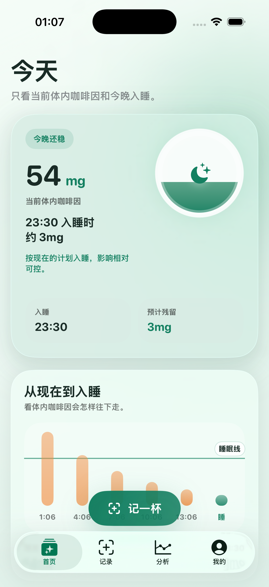
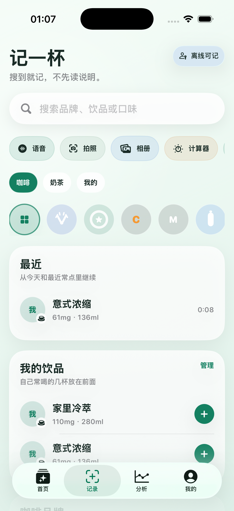
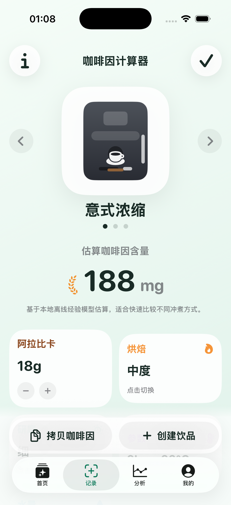
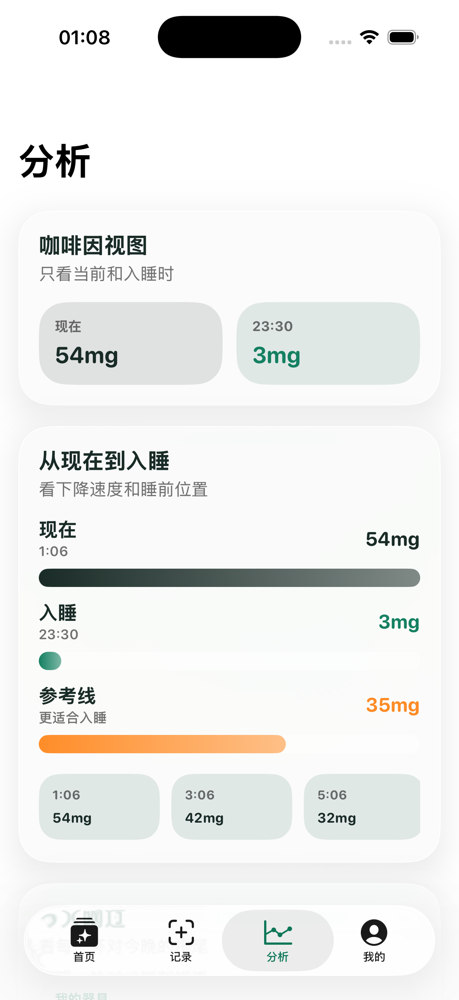
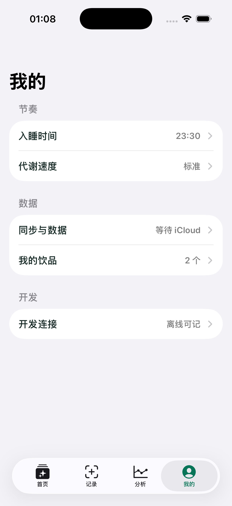
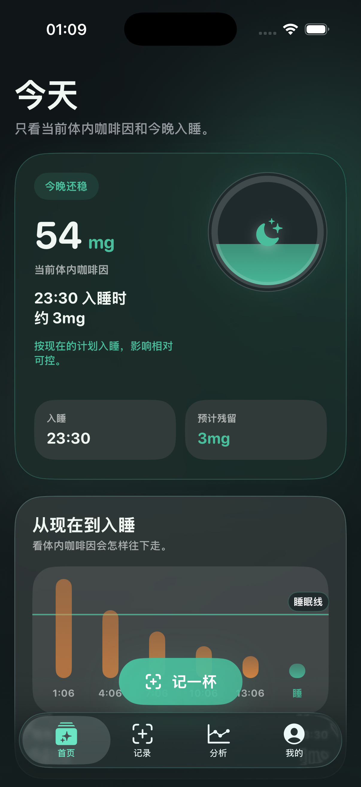

# 饮知 Yinzhi

本地优先的咖啡因记录 App。当前主线是：`随手记一杯 -> 立刻看到体内咖啡因和入睡残留 -> 在 Apple 生态内保持离线可用`。

## 当前状态
- 产品方向：咖啡 / 奶茶优先的日常记录，不做用户侧 AI 推荐主叙事
- 架构方向：`本地优先、后端辅助`
- 体验方向：首页只看状态，记录页优先品牌与快速录入，分析页只看咖啡因时间视图
- 平台状态：`iOS` 为当前成熟端，`HarmonyOS` 已进入 `Stage + ArkTS` 并已在 `HarmonyOS 6.0.2` 工具链下成功本地打包
- 默认 starter pack：`瑞幸`、`星巴克`、`库迪`、`喜茶`、`霸王茶姬`、`一点点`

## 页面与功能

### 首页
只保留当前体内咖啡因、入睡残留和从现在到入睡的走势。
- 功能：查看当前体内咖啡因、入睡时预计残留、今晚状态标签
- 交互：底部浮动 `记一杯`、快速跳转到记录页
- 设计重点：弱化解释性文字，强化时间感和状态感



### 记录页
顶部是搜索和快速入口，下面是品牌小 logo rail、最近记录、我的饮品和品牌目录。品牌识别尽量交给 logo，不让文字挤满首屏。
- 功能：搜索、语音、拍照、相册、计算器、最近复用、品牌筛选
- 设计重点：先完成记录，再浏览目录；row 尽量薄，信息只保留名称、咖啡因、杯型



### 咖啡因计算器
用于意式、手冲、胶囊的离线估算。首屏先给答案，再通过参数卡微调。
- 功能：切换冲煮方式、调整参数、估算咖啡因、存为我的饮品、直接记录一杯
- 设计重点：先给结果，再给参数；插图优先服务辨识度



### 分析页
只看当前到入睡时的咖啡因位置，不再堆一层层解释性卡片。
- 功能：查看时间视图、摄入事件点、入睡时间参考
- 设计重点：把“会不会影响入睡”压缩成一眼能懂的曲线表达



### 我的
采用多级列表设置，收口到节奏、同步、数据和开发连接。
- 功能：入睡时间、代谢档位、同步模式、数据管理、我的饮品、开发连接
- 设计重点：一级页只做入口，具体设置全部下沉到二级页面



### 浅色 / 深色自动适配
设计系统默认跟随系统外观，首页关键数值、睡眠线和主 CTA 在两套外观下都保持可读。
- 功能：自动跟随系统浅色 / 深色外观
- 设计重点：优先保证关键数值、阈值线、主按钮和卡片层级可读



### 开发者 Support / Admin
后端保留本地开发控制台和管理接口，用于目录维护、规则调试、反馈处理和 LLM 联调。
- 页面入口：`/support`
- 数据接口：`/v1/admin/support`
- 当前定位：开发辅助能力，不进入用户主记录链路

## 当前能力清单
- 快速记录：搜索、语音、拍照、相册、最近复用、品牌目录
- 品牌目录：小 logo rail + 极简 row
- 咖啡因模型：当前体内估算、入睡时预计残留、时间视图
- 冲煮计算：意式机、手冲、胶囊
- 本地数据：离线记录、个人饮品模板、个人设置
- 同步边界：`SyncProvider + iCloud` 缝
- 后端辅助：品牌目录、support/admin、导出、LLM 联调入口

## 仓库结构
- `ios/`: SwiftUI iPhone App
- `harmony/`: HarmonyOS `Stage + ArkTS` 工程与页面实现
- `backend/`: FastAPI 辅助后端与 support/admin
- `Sources/YinzhiCore/`: 可独立测试的 Swift 领域逻辑
- `docs/`: 长期产品、架构、质量文档
- `openspec/`: 每一轮变更的 proposal / design / tasks / spec
- `scripts/`: 本地开发与 Podman / Xcode 辅助脚本

## 快速开始
```bash
./scripts/setup-backend.sh
./scripts/setup-harmony-cli.sh
swift test
source .venv/bin/activate && pytest backend/tests -q
xcodebuild -project ios/Yinzhi.xcodeproj -scheme Yinzhi -destination 'platform=iOS Simulator,name=iPhone 17 Pro' build
./scripts/check-harmony-env.sh
./scripts/prepare-harmony-project.sh
(cd harmony && ./hvigorw PackageApp)
```

## 文档入口
- [docs/README.md](docs/README.md)：长期文档导航
- [agent.md](agent.md)：项目地图、当前阶段、活跃变更
- [openspec/README.md](openspec/README.md)：OpenSpec 变更导航
- [ADR-0003](docs/decisions/ADR-0003-local-first-architecture.md)：当前正式架构路线
- [harmony/README.md](harmony/README.md)：HarmonyOS 工程与环境说明

## 文档清理说明
- `ADR-0001`、`ADR-0002` 继续保留为历史记录，但当前路线统一以 `ADR-0003` 为准
- 历史 OpenSpec change 继续保留，但页面和架构结论优先看 `README.md`、`docs/README.md`、`agent.md`
- 不再新增与现有真源重复的说明文档，优先把信息合并回现有导航和 ADR / spec
